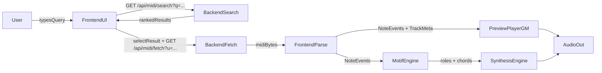

## MIDI playback MVP — detailed technical integration plan

### Product target (MVP)
- **User flow**:
  1) User types a song name (e.g. “Hotel California”)
  2) App searches MIDI sources and shows a ranked list
  3) User selects a result and can **play the MIDI “correctly”** using **General MIDI soundfonts**
  4) User can then click **Generate Motif** to synthesize a “similar-but-different” version from the same parsed MIDI

### Current code reality (gaps to close)
- **Search is currently biased toward mock/synthetic**, not real MIDI:
  - `server/src/services/MIDISearchService.ts` includes `MockAdapter` first.
- **Fetch can silently replace real URLs with synthetic MIDI**:
  - `server/src/services/MIDIFetchService.ts` generates synthetic MIDI when URL contains `bitmidi.com/uploads`, preventing true BitMidi playback.
- **Frontend preview is oscillator-based**, not GM soundfont playback.

---

## Architecture (what we’ll ship)

---

## Phase 0 — “Real MIDI mode” defaults (backend hardening)

### 0.1 Gate mock adapter behind env flag
- **Change**: In `server/src/services/MIDISearchService.ts`, make adapters:
  - Default: `[BitMidiAdapter, DongraysAdapter]`
  - Optional: prepend `MockAdapter` only if `USE_MOCK_ADAPTER=1` (or similar)
- **Acceptance**:
  - Searching “Hotel California” returns **non-`synthetic:*`** results when internet is available.
  - Devs can still run offline with `USE_MOCK_ADAPTER=1`.

### 0.2 Stop auto-synth overriding real URLs in fetch
- **Change**: In `server/src/services/MIDIFetchService.ts`, only synthesize when:
  - `url.startsWith('synthetic:')` (and optionally if `USE_SYNTHETIC_FETCH=1`)
- **Remove**: `url.includes('bitmidi.com/uploads')` synthetic shortcut
- **Acceptance**:
  - Selecting a BitMidi result triggers a real network fetch and caches the real bytes.
  - If the remote file is invalid, it fails explicitly with a clear error.

### 0.3 Make backend behavior explicit in responses (optional but recommended)
- **Change**: Add response fields or headers indicating source:
  - Example: `X-Motif-Source: real|synthetic|cache`
- **Acceptance**:
  - Frontend can display “cached”/“live”/“synthetic fallback” badges (helps debugging + trust).

---

## Phase 1 — GM soundfont playback (frontend “Preview” becomes correct MIDI playback)

### 1.1 Dependency choice & asset strategy
- **Dependency**: add a browser-friendly soundfont player dependency (e.g. `soundfont-player`).
- **Soundfont hosting**:
  - Prefer static hosting under `/public/soundfonts/` (versioned with the app)
  - Or use a CDN, but pin versions and handle CORS
- **MVP instrument set**:
  - Minimum viable: **Acoustic Grand Piano** for all melodic tracks, and a basic drum fallback
  - Better: load instruments on demand per track program

### 1.2 Implement `SoundfontMIDIPlayer`
Create `src/synthesis/SoundfontMIDIPlayer.ts` with:
- **Responsibilities**
  - Load instruments (program → soundfont instrument name)
  - Schedule note-on/note-off with WebAudio timing
  - Provide `load(midi)` / `play()` / `stop()` / `setVolume()` APIs
- **Inputs**
  - Best: use `@tonejs/midi`’s `Midi` object (tracks include `instrument.number`, `notes`, `channel`)
  - Alternate: keep using `NoteEvent[]`, but you’ll lose program/channel unless you extend the event model
- **Timing correctness**
  - Use seconds-based timing from `@tonejs/midi` notes (`time`, `duration` are in seconds)
  - Ensure AudioContext resumes on user gesture
- **Drums**
  - If channel 9/10 is detected: either map to a percussion kit if supported, or skip drums for MVP (but be explicit in UI)

### 1.3 Wire UI to use soundfont preview
- In `src/main.ts`, replace/augment the current oscillator `MIDIPlayer` usage:
  - Preview buttons should play via `SoundfontMIDIPlayer`
  - Keep existing Motif buttons intact
- Keep oscillator preview only as a fallback if soundfonts fail to load (optional).

---

## Phase 2 — “Play the real song correctly” UX loop

### 2.1 Search UX requirements
- **Result list must show**:
  - title, source, confidence
  - parsed metadata: duration, track count, issues
- **Selection behavior**:
  - Selecting a row fetches + parses once; enables Preview + Generate Motif

### 2.2 Error handling (user-facing)
Define user-facing error classes/messages:
- **Search**: “No results”, “Backend unavailable”, “Rate limited / source blocked”
- **Fetch**: “MIDI file blocked”, “Invalid MIDI header”, “Quality rejected”
- **Parse**: “Unsupported MIDI features” / “Parse failed”
- **Preview playback**: “Soundfont failed to load” / “Audio not allowed until click”

### 2.3 Observability (dev-facing)
- Backend: log adapter failures per source + timings
- Frontend: log selected MIDI URL, parse duration, instrument load times
- Optional: a small “Debug” accordion showing chosen URL, cache hit, parse issues, loaded instruments

---

## Phase 3 — Motif generation stays step 2 (but align data model)
- Keep the current path:
  - `MotifEngine.generateFromMIDI(NoteEvent[])` then `MotifEngine.play()`
- Recommended alignment work:
  - Decide whether Motif should later consume richer track metadata (program/channel) to improve role mapping.

---

## Integration milestones & acceptance checks

### Milestone A — Real MIDI end-to-end
- Search returns results from BitMidi/Dongrays with mock disabled by default
- Fetch returns real bytes and caches them
- Parse endpoint `/api/midi/parse` works for metadata

### Milestone B — “Correct” preview playback
- Preview produces recognizable instrument playback (piano at minimum)
- Stop reliably stops scheduled notes
- Works in Chrome/Safari with autoplay policies (requires click)

### Milestone C — Motif as second step
- Generate Motif still works on the same loaded MIDI
- Preview and Motif can be A/B tested without reloading the page

---

## Recommended team task breakdown

### Backend engineer
- Implement env gating for mock/synthetic
- Tighten fetch behavior + ensure BitMidi URLs are truly fetched
- Add explicit “source = real/cache/synthetic” marker

### Frontend engineer
- Add the chosen soundfont library
- Implement `SoundfontMIDIPlayer`
- Wire `src/main.ts` preview buttons to soundfont playback
- Add user-facing error messaging for soundfont failures

### QA / test harness
- Maintain a short list of known-good queries (3–5 songs) and confirm:
  - search results appear
  - at least one MIDI fetches and plays
  - Motif plays afterward
