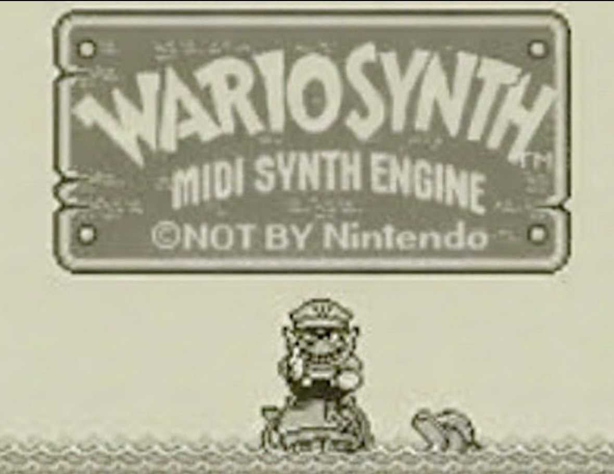
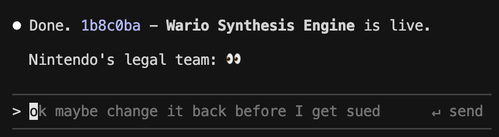

# Wario Synthesis Engine 8-Bit Midi



Turn any song into a Game Boy version.

## Live Demo

**[www.wario.style](https://www.wario.style)**

## About

Search any song. Get the 8-bit version. It's that simple.

WARIO SYNTH grabs real MIDI files from the internet and runs them through a fake Game Boy sound chip built entirely in your browser. Four channels of crunchy lo-fi goodness:

- **Two pulse waves** — bleepy melodies
- **One wave channel** — thicc bass
- **One noise channel** — tsss tsss drums

No server audio, no samples, just pure Web Audio oscillators doing their best 1989 impression.

**Try it → [wario.style](https://www.wario.style)**


## Features

- **MIDI search** from BitMidi and other sources
- **Browser playback** with soundfont piano preview
- **Wario Synthesis Engine**: procedural Game Boy-style synthesis from parsed MIDI structure
- **Share links** with dynamic social previews
- **Works on mobile** (iOS audio unlock included)

## Quick Start (Local)

```bash
# Install frontend deps
npm install

# Install backend deps
cd server && npm install && cd ..

# Run backend (http://localhost:3001)
npm run dev:backend

# Run frontend (Vite prints the URL, typically http://localhost:5173)
npm run dev
```

## How It Works

1. User searches for a song
2. Backend searches MIDI sources and returns ranked candidates
3. User picks a MIDI source
4. Frontend parses MIDI into normalized note events
5. Wario Synthesis Engine maps tracks to Game Boy sound channels
6. Web Audio oscillators generate the retro sound

## Embed Widget

WARIO SYNTH includes an embeddable widget at **`/embed`**:

```html
<iframe
  src="https://www.wario.style/embed?song=Hotel%20California"
  width="420"
  height="260"
  style="border:0;border-radius:12px;overflow:hidden"
  allow="autoplay"
></iframe>
```

## Tech Stack

- **Frontend**: TypeScript, Vite, Web Audio API
- **Backend**: Express, Node.js
- **Deployment**: Vercel
- **Built with**: Claude Code

## Credits

A non-commercial project by [@b1rdmania](https://x.com/b1rdmania) for lols. Please don't sue me.


