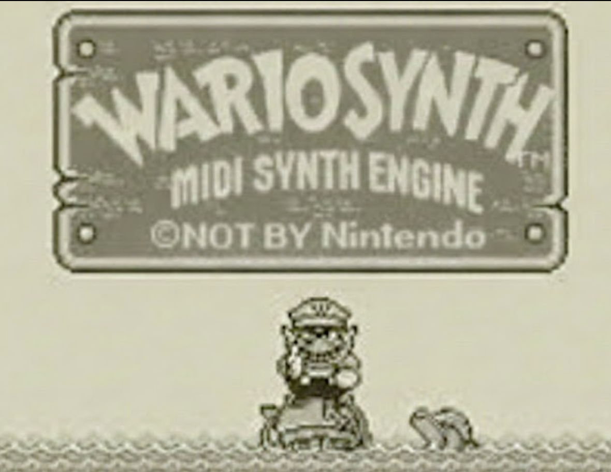
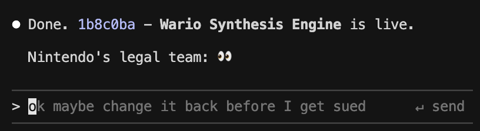

# Wario Synthesis Engine 8-Bit Midi



Turn any song into a Game Boy version.

## Live Demo

**[www.wario.style](https://www.wario.style)**

## About

**WAH!** 🎮

Type in literally any song. We'll find a MIDI file somewhere on the internet and absolutely demolish it through a janky homebrew Game Boy sound chip running in your browser.

Is it accurate? Sometimes. Is it legal? Probably. Does it slap? **Absolutely.**

Four glorious channels of chiptune chaos:
- 🟨 **Pulse 1** — screamy lead melodies
- 🟨 **Pulse 2** — whatever pulse 1 forgot
- 🟩 **Wave** — chunky bass that hits different
- ⬜ **Noise** — percussion (tssss pshhhh)

Zero samples. Zero server audio. Just raw oscillators having the time of their lives.

**[wario.style](https://www.wario.style)** ← go make your favorite song worse


## Features

- **MIDI search** from BitMidi, called directly from the browser (no server round-trip)
- **Local MIDI upload** — load your own `.mid` / `.midi` files (client-side only)
- **Browser playback** with soundfont piano preview
- **Wario Synthesis Engine**: procedural Game Boy-style synthesis from parsed MIDI structure
- **Save Audio (WAV) and Save MIDI** — export the generated result after playback
- **Share links** with dynamic social previews — works for searched MIDI sources; not available for local uploads
- **Works on mobile** (iOS audio unlock included)
- **v2 beta engine** (`/v2.html`, or the "v2 beta" tab): an experimental engine that targets the real Game Boy chip (Sharp LR35902) with a 15-bit LFSR noise channel, proper pulse duty cycles, and custom wavetables. The synthesis is authentic; arranging arbitrary MIDI onto 4-8 fixed voices is the open problem — see [issue #5](https://github.com/b1rdmania/motif/issues/5)

See [CHANGELOG.md](./CHANGELOG.md) for release history.

## Quick Start (Local)

```bash
# Install frontend deps
npm install

# Install backend deps
cd server && npm install && cd ..

# Run backend (http://localhost:3001)
npm run dev:backend

# Run frontend (Vite prints the URL, typically http://localhost:5173)
npm run dev
```

## How It Works

1. User searches for a song **or uploads a local MIDI file**
2. The browser queries BitMidi's CORS-enabled JSON API directly and ranks the candidates client-side
3. User picks a MIDI source or uploaded file
4. Frontend parses MIDI into normalized note events
5. Wario Synthesis Engine maps tracks to Game Boy sound channels
6. Web Audio oscillators generate the retro sound
7. Optional: save the generated result as WAV or MIDI

## Embed Widget

WARIO SYNTH includes an embeddable widget at **`/embed`**:

```html
<iframe
  src="https://www.wario.style/embed?song=Hotel%20California"
  width="420"
  height="260"
  style="border:0;border-radius:12px;overflow:hidden"
  allow="autoplay"
></iframe>
```

## Tech Stack

- **Frontend**: TypeScript, Vite, Web Audio API
- **Backend**: Express, Node.js
- **Deployment**: Vercel
- **Built with**: Claude Code

## Credits

A non-commercial project by [@b1rdmania](https://x.com/b1rdmania) for lols. Please don't sue me.


